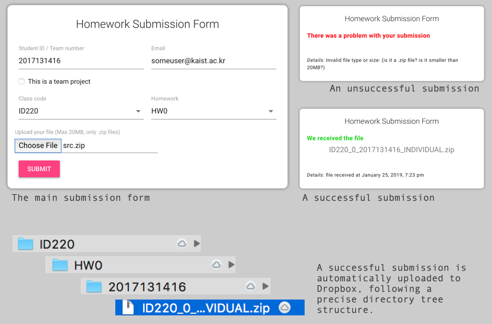

# Homework2Dropbox

## Overview
**Homework2Dropbox** allows students to upload their homework on a form, and the instructor to receive the uploaded file in a Dropbox folder. The name of the file is formatted for easy retrieval, and it is stored in a folder following a precise tree structure (see image below).

This software is very simple, but does the job. However, it does not provide any special security feature. Anyone can upload a file, and although a copy of each submitted file remains in an archive folder on the server, a submission with the same name overrides the any prior submission with the same name in the Dropbox folder.

The software is free of use and can be modified. **Use it at your own risk**.



## How to install

### Setup dependencies

Your server needs to be able to run Python (>2.7) and PHP (>7.2). You also need to install a couple of Python modules for using **Dropbox** and **configparser**. Please refer to the [Dropbox](https://www.dropbox.com/developers/documentation/python) developers' docs. You might simply need to install your dependencies with pip, like this:

```
pip install configparser --user
pip install dropbox --user
```

or like this:

```
pip install configparser
pip install dropbox
```
Finally, you need to setup an app with Dropbox and generate a secret *TOKEN* string - you'll need it later.

### Installation

Close the repository on your server.

```
git clone https://github.com/makinteract/Homework2DropBox.git
cs Homework2DropBox
```

With an text editor of choice, open the file **python -> dropbox_uploader.py** and make sure that the first line shows the path to your Python installation.

```
# Point this to your python installation
#!/usr/bin/python
```

Finally, open the **config.ini** file and copy here the token from Dropbox and the location of the path to the repository. You can also modify the other variables, but it is not necessary.

For example:

```
; config.ini
[DEFAULT]
TOKEN= jaslfkjasldjf adsfasdf8as09d8fasdfjasldkfjkasdjflkas
BASE_DIR= /Users/andrea/GIT/Homework2DropBox/
UPLOAD_DIR= files/upload/
ARCHIVE_DIR= files/archive/
MAX_FILE_SIZE= 20000000
```
You are all set.

### Usage

Point your web-browser to the **index.html** file, fill up the form and upload your file.

### Video

You can see a video that explains this process further at [this link](....)
